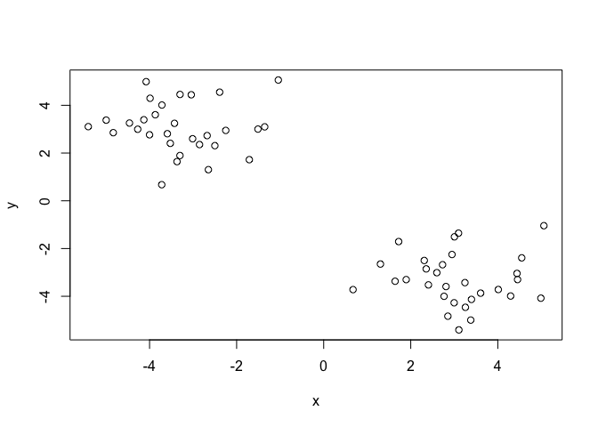
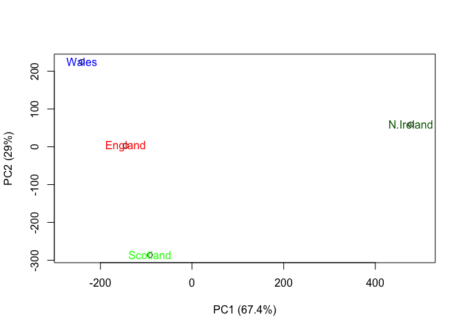

Lecture09
================
Saroj Gourkanti
2/5/2020

## R Markdown

This is an R Markdown document. Markdown is a simple formatting syntax
for authoring HTML, PDF, and MS Word documents. For more details on
using R Markdown see <http://rmarkdown.rstudio.com>.

When you click the **Knit** button a document will be generated that
includes both content as well as the output of any embedded R code
chunks within the document. You can embed an R code chunk like this:

``` r
summary(cars)
```

    ##      speed           dist       
    ##  Min.   : 4.0   Min.   :  2.00  
    ##  1st Qu.:12.0   1st Qu.: 26.00  
    ##  Median :15.0   Median : 36.00  
    ##  Mean   :15.4   Mean   : 42.98  
    ##  3rd Qu.:19.0   3rd Qu.: 56.00  
    ##  Max.   :25.0   Max.   :120.00

## Including Plots

You can also embed plots, for example:

<!-- -->

Note that the `echo = FALSE` parameter was added to the code chunk to
prevent printing of the R code that generated the plot.

## K-means clustering

Let’s try the `kmeans()` function in R to cluster some made-up example
data

rnorm gives you a set of numbers (first argument) whose average is equal
to a specific number (second argument)

cbind combines objects by rows or columns based on given names in
argument, can define names as stored vectors

``` r
tmp <- c(rnorm(30,-3), rnorm(30,3))
x <- cbind(x=tmp, y=rev(tmp))
plot(x)
```

<!-- -->

Can use kmeans to cluster data based on where you assign centers(k
value) and size of clusters (nstart)

``` r
km <- kmeans(x, centers = 2, nstart = 20)

km
```

    ## K-means clustering with 2 clusters of sizes 30, 30
    ## 
    ## Cluster means:
    ##           x         y
    ## 1  3.063113 -3.299309
    ## 2 -3.299309  3.063113
    ## 
    ## Clustering vector:
    ##  [1] 2 2 2 2 2 2 2 2 2 2 2 2 2 2 2 2 2 2 2 2 2 2 2 2 2 2 2 2 2 2 1 1 1 1 1 1 1 1
    ## [39] 1 1 1 1 1 1 1 1 1 1 1 1 1 1 1 1 1 1 1 1 1 1
    ## 
    ## Within cluster sum of squares by cluster:
    ## [1] 66.16953 66.16953
    ##  (between_SS / total_SS =  90.2 %)
    ## 
    ## Available components:
    ## 
    ## [1] "cluster"      "centers"      "totss"        "withinss"     "tot.withinss"
    ## [6] "betweenss"    "size"         "iter"         "ifault"

``` r
km$size
```

    ## [1] 30 30

let’s check how many 2s and 1s are in the cluster vector of km with the
`table()` function

``` r
table(km$cluster)
```

    ## 
    ##  1  2 
    ## 30 30

Plot x colored by the kmeans cluster assignment and add cluster centers
as blue points

``` r
plot(x, col= km$cluster)
points(km$centers, col="blue", pch=15, cex=3)
```

<!-- -->
Can pick specific colors for each set by using c(rep(“red”, 30),
rep(“blue”, 30))

For hierarchical clusterin , can use hclust function. the `hclust()`
function is the main Hierarchical clustering method in R and it **must**
be passed a **distance matrix** as input, not your raw data

Can add line to plot using abline

``` r
hc <- hclust(dist(x))

plot(hc)
abline(h=6, col = "red")
```

<!-- -->
To only read out specific part of plot, can use cutree(hc, h= where you
want to cut off) or use k= number of clusters you want to cut tree off
at

``` r
plot(hc)
abline(h=6, col = "red", lty=2)
```

<!-- -->

``` r
cutree(hc, k=4)
```

    ##  [1] 1 1 1 2 2 2 1 2 1 2 2 1 1 2 2 1 2 2 1 2 1 2 1 1 2 2 2 1 1 1 3 3 3 4 4 4 3 3
    ## [39] 4 3 4 3 4 4 3 4 4 3 3 4 4 3 4 3 4 4 4 3 3 3

``` r
x <- rbind(
 matrix(rnorm(100, mean=0, sd=0.3), ncol = 2), # c1
 matrix(rnorm(100, mean=1, sd=0.3), ncol = 2), # c2
 matrix(c(rnorm(50, mean=1, sd=0.3), # c3
 rnorm(50, mean=0, sd=0.3)), ncol = 2))
colnames(x) <- c("x", "y")

plot(x)
```

<!-- -->

``` r
# Step 3. Generate colors for known clusters
# (just so we can compare to hclust results)
col <- as.factor( rep(c("c1","c2","c3"), each=50) )
plot(x, col=col)
```

<!-- -->

``` r
hc <- hclust(dist(x))

plot(hc)
```

<!-- -->

``` r
grps3 <- cutree(hc, k=3)
plot(x, col= grps3 + 1)
```

<!-- -->

# Principal Component Analysis (PCA

TH emain fucntion in base R for PCA is called `prcomp()` Here we awill
use PCA to examine the funny food people eat in the UK and N. Ireland.

``` r
x <- read.csv("UK_foods.csv", row.names = 1)
x
```

    ##                     England Wales Scotland N.Ireland
    ## Cheese                  105   103      103        66
    ## Carcass_meat            245   227      242       267
    ## Other_meat              685   803      750       586
    ## Fish                    147   160      122        93
    ## Fats_and_oils           193   235      184       209
    ## Sugars                  156   175      147       139
    ## Fresh_potatoes          720   874      566      1033
    ## Fresh_Veg               253   265      171       143
    ## Other_Veg               488   570      418       355
    ## Processed_potatoes      198   203      220       187
    ## Processed_Veg           360   365      337       334
    ## Fresh_fruit            1102  1137      957       674
    ## Cereals                1472  1582     1462      1494
    ## Beverages                57    73       53        47
    ## Soft_drinks            1374  1256     1572      1506
    ## Alcoholic_drinks        375   475      458       135
    ## Confectionery            54    64       62        41

Make some conventional
plots

``` r
barplot(as.matrix(x), beside=T, col = rainbow(nrow(x)))
```

<!-- -->

``` r
pairs(x, col= rainbow(10), pch=16)
```

<!-- -->

use PCA to get better analysis of data

``` r
pca <- prcomp( t(x))

#need to transpose as PCA prefers each country as row names
```

``` r
summary(pca)
```

    ## Importance of components:
    ##                             PC1      PC2      PC3       PC4
    ## Standard deviation     324.1502 212.7478 73.87622 4.189e-14
    ## Proportion of Variance   0.6744   0.2905  0.03503 0.000e+00
    ## Cumulative Proportion    0.6744   0.9650  1.00000 1.000e+00

``` r
attributes(pca)
```

    ## $names
    ## [1] "sdev"     "rotation" "center"   "scale"    "x"       
    ## 
    ## $class
    ## [1] "prcomp"

Generate PCA
plot

``` r
plot(pca$x[,1], pca$x[,2], xlab="PC1 (67.4%)", ylab="PC2 (29%)", xlim=c(-270,500))
text(pca$x[,1], pca$x[,2], colnames(x),
     col= c("red", "blue", "green", "darkgreen"))
```

<!-- -->
